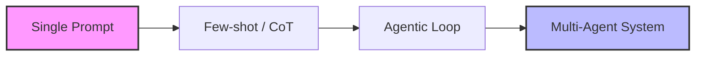
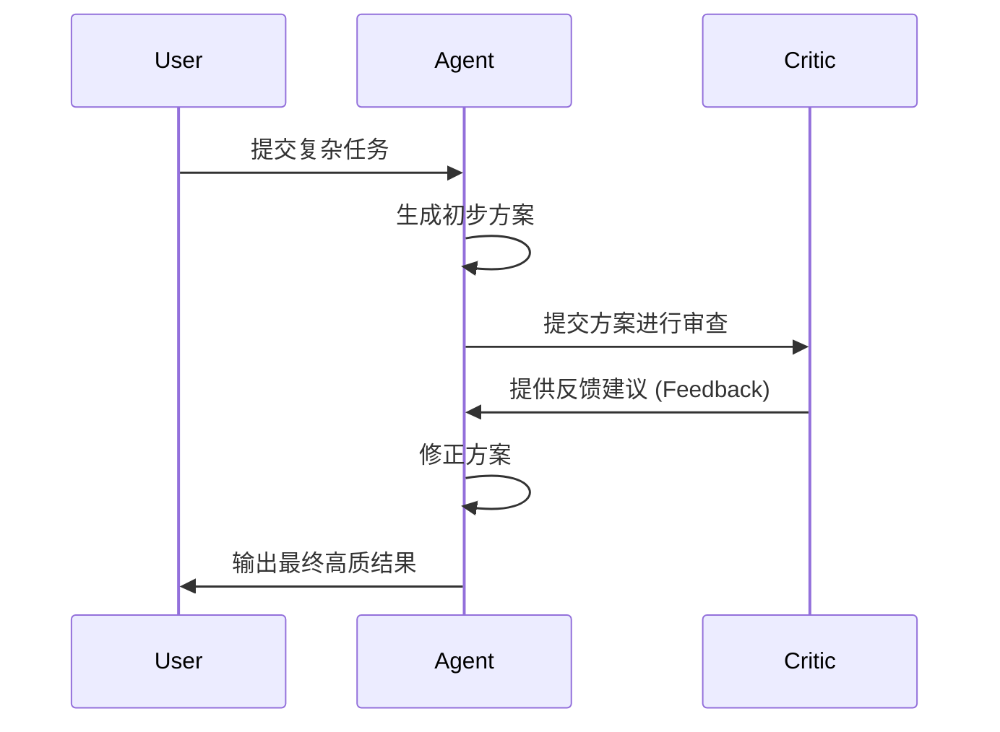

# Agentic Workflow：从提示词工程到 Agent 任务编排的演进

## 1. 核心综述 (Executive Summary)

当大模型（LLM）从单次对话（Chat）演进到自主执行任务（Agent）时，其效率的提升不再单纯依赖模型参数的增加，而在于**工作流设计（Workflow Design）**。本研究探讨如何通过规划（Planning）、反思（Reflection）和工具调用（Tool Use）构建可落地的智能体协作链路，并提出一套可扩展的 Agent 任务编排框架。

## 2. 工作流演进路径 (Evolution Path)

传统的 Prompt Engineering 已经触及天花板，Agentic Workflow 是实现业务闭环的必经之路。

## 3. 核心设计模式 (Design Patterns)

### 3.1 规划与拆解 (Planning)
Agent 接收到高层意图后，首先利用思维链（CoT）或子任务分解技术。
- **ReAct 模式**：推理（Reasoning） + 行动（Acting），在执行中不断修正认知。
- **任务依赖树**：构建有向无环图（DAG），明确子任务的先后逻辑。

### 3.2 反思与自我修正 (Reflection)
通过引入“自我批评”层级，大幅提升输出质量。

### 3.3 工具调用 (Tool Use / Function Calling)
赋予 Agent 操作外部世界的能力（API, Web Search, Data Analytics）。
- **工具描述协议**：标准化的 JSON Schema 描述。
- **沙箱化执行**：保障代码生成的安全性。

## 4. 多智能体协作 (Multi-Agent Systems)

在复杂任务场景下，单个 Agent 往往无法覆盖所有专业领域。
- **Role-based Team**：如“架构师 + 程序员 + 测试员”的协作模式。
- **Hierarchical Layout**：主管 Agent 负责任务调度，执行 Agent 负责垂直交付。

## 5. 工程化挑战与解决方案 (Engineering Challenges)

| 挑战 | 表现 | 解决方案 |
| :--- | :--- | :--- |
| **延迟 (Latency)** | Agent 循环导致响应变慢 | 异步流式输出与中间态缓存 |
| **成本 (Token Cost)** | 无限循环导致费用爆炸 | 设置最大循环步数 (Max Loops) 与状态压缩 |
| **稳定性 (Reliability)** | 过程不可控，结果随机 | 结构化输出校验 (Pydantic / Regex) |

## 6. 未来展望：从任务编排到“智能治理”

未来的 Agent 不再仅仅是工具，而是企业数字资产的共同维护者。
- **自进化 Agent**：能够基于知识库（uWisdom）自我优化 Prompt。
- **Agentic OS**：像管理进程一样管理成千上万个活跃的智能体。

---

## 关联研究
- [[topic-research/ai-native-enterprise|AI 原生企业重构研究]]
- [[knowledge-base/themes/llm-application-architecture|LLM 应用架构体系]]
- [[knowledge-base/themes/agent-workflow-design|Agent 工作流设计实践]]
