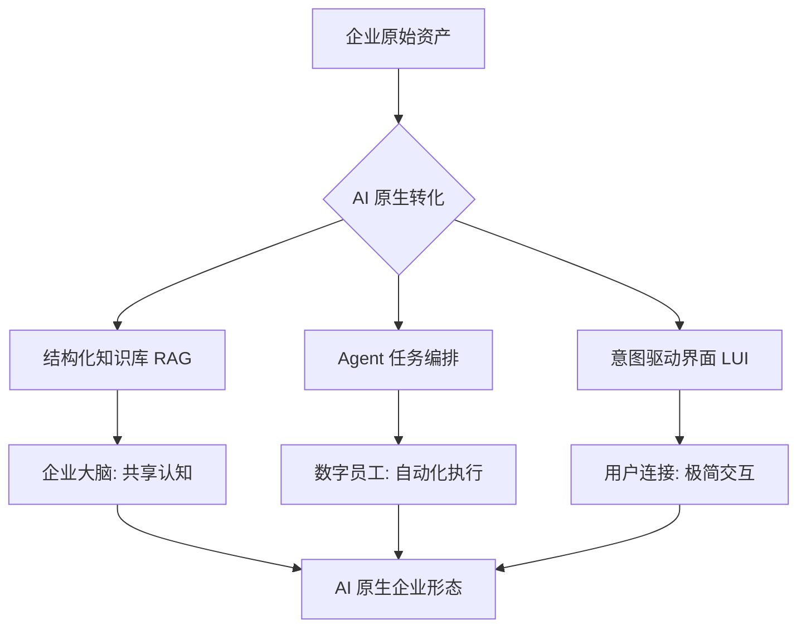

# AI 原生企业：从数字化到智能化的范式重构

## 1. 核心综述 (Executive Summary)

AI 原生企业（AI-Native Enterprise）不仅仅是在现有流程中“加入 AI”，而是将大语言模型（LLM）和 AI Agent 作为企业最底层的“操作系统”。本研究探讨如何通过结构化知识资产、Agent 编排工作流和意图驱动的产品形态，实现企业从“数字辅助”向“智能驱动”的彻底转型。

## 2. 战略背景与必要性 (Strategic Context)

在传统的数字化转型中，企业解决了“数据在线”的问题，但并未解决“知识流动”与“自动化决策”的效率瓶颈。
- **痛点**：知识碎片化（存储在文档中而非逻辑中）、决策依赖人脑（不可扩展）、流程僵化。
- **趋势**：从 SaaS（软件即服务）转向 MaaS（模型即服务）与 AaaS（Agent 即服务）。

## 3. 核心架构逻辑 (Architecture Logic)

AI 原生企业的构建遵循“知识-逻辑-执行”的三层重构逻辑。

## 4. 深度研究领域 (Research Domains)

### 4.1 知识能力的原子化与资产化
传统的文档库是“死”的。AI 原生要求知识必须是“机器可读”的。
- **原子化条目**：将说明书、规章制度转化为 `id-summary-rule` 结构的 JSON/Markdown。
- **语义索引**：通过 Vector Database 实现跨部门的语义联想。
- **知识演进**：建立知识的“版本管理”机制（类似 Git）。

### 4.2 流程能力的 Agent 化
将 BPM（业务流程管理）升级为 Agentic Workflow。
- **规划 (Planning)**：Agent 接收模糊指令，自动拆解步骤。
- **反思 (Reflection)**：Agent 自我检查输出质量，减少幻觉。
- **工具调用 (Tool Use)**：Agent 自动调用 ERP/CRM 接口完成闭环。

### 4.3 产品形态的意图驱动
从 GUI（图形界面）转向 LUI（语言界面）。
- **去层级化导航**：用户直接说出目的，系统自动触达深层功能。
- **自适应 UI**：界面根据 AI 预测的需求动态生成。

## 5. 实施路径图 (Implementation Roadmap)

| 阶段 | 核心任务 | 关键产出 |
| :--- | :--- | :--- |
| **第一阶段：基座搭建** | 建立企业级 RAG 与私有模型接入层 | 企业专属知识百科 (Wiki-Agent Ready) |
| **第二阶段：局部 Agent 化** | 在客服、研发、法务等领域引入助手 | 关键岗位效率提升 300% |
| **第三阶段：流程重组** | 废弃传统审批流，改用意图驱动工作流 | AI 原生流程模型 v1.0 |
| **第四阶段：组织演进** | 设立 AI 治理委员会，重塑考核体系 | 智能驱动的敏捷组织 |

## 6. 机会评估与未来展望

AI 原生化将产生显著的“机会红利”：
- **成本降低**：人力密集型流程成本下降 80%。
- **响应速度**：从“天”级反馈缩短至“秒”级响应。
- **竞争优势**：由于知识资产的沉淀，企业具备更强的学习与进化速度。

---

## 关联研究
- [[topic-research/personal-knowledge-operating-system|个人知识操作系统]]
- [[topic-research/openclaw-agent-ecosystem|OpenClaw Agent 生态研究]]
- [[knowledge-base/domains/ai-expert|人工智能专家领域]]
