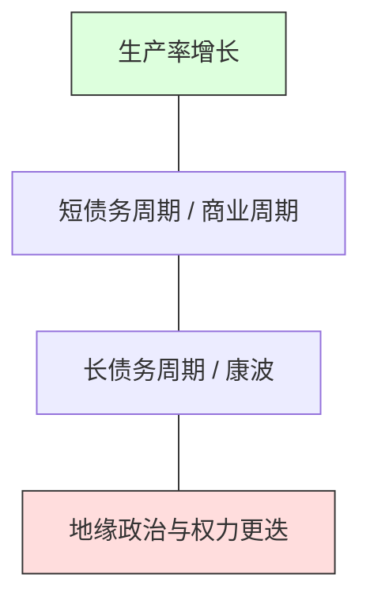

# 全球宏观周期与资产配置深度研究

## 1. 核心综述 (Executive Summary)

投资的本质是对“周期”的理解与概率的博弈。本研究聚焦于达里奥（Ray Dalio）的长债务周期理论、康德拉季耶夫长波（K-Waves）以及当前地缘政治范式转移对全球资产配置的影响。旨在构建一个能够动态适应通胀、通缩、增长与衰退四象限的“全天候”认知框架。

## 2. 宏观周期多维驱动模型 (Drivers Model)

宏观经济不是单一线性的，而是由三个主要循环交织而成。

- **生产率 (Productivity)**：长期价值的底座（如目前的 AI 革命）。
- **短周期 (5-8年)**：由央行利率与信贷供需驱动。
- **长周期 (50-75年)**：由债务总额、贫富差距与世界秩序重组驱动。

## 3. 资产配置四象限框架 (Economic Quadrants)

根据“经济增长”与“通货膨胀”的超预期方向，构建资产配置矩阵。

| | 增长超预期 (Rising Growth) | 增长低预期 (Falling Growth) |
| :--- | :--- | :--- |
| **通胀超预期 (Rising Inflation)** | 股票、商品、黄金、新兴市场 | 黄金、抗通胀债券 (TIPS)、商品 |
| **通胀低预期 (Falling Inflation)** | 股票、债券、成长性科技股 | 长期国债、现金 (Deflationary hedge) |

## 4. 深度研究领域：AI 时代的生产率奇点

本阶段研究的核心假设是：AI 是否能够终结长债务周期的停滞？
- **假设 1**：AI 带来的效率提升能够稀释债务负担（通过高速增长）。
- **假设 2**：AI 导致资本回报率远超劳动回报率，进一步加剧社会分化，触发布局层面的范式转移。

## 5. 风险评估与机会感知 (Risk & Opportunity)

### 5.1 尾部风险 (Tail Risks)
- **去全球化**：供应链重组导致的成本长期通胀。
- **货币范式转移**：从单一主权货币向多极化储备资产转型。

### 5.2 机会感知
- **硬资产复兴**：在长周期末端，具备稀缺性的实物资产价值凸显。
- **效率溢价**：能够率先完成“AI 原生”转型的行业龙头。

## 6. 核心方法论：归一化观察法

1. **观察信贷增速**：判断短周期的顶部与底部。
2. **观察实际利率**：判断法币的真实购买力。
3. **观察研发投入**：判断生产率奇点是否临近。

---

## 关联研究
- [[knowledge-base/themes/market-cycle-observation|市场周期观察体系]]
- [[knowledge-base/domains/financial-markets|金融市场领域地图]]
- [[knowledge-base/domains/technology-investment|技术投资深度研究]]
