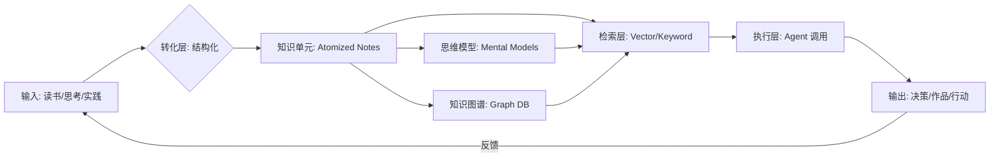

# 个人知识操作系统：从碎片记录到智慧涌现的重构

## 1. 核心综述 (Executive Summary)

个人知识操作系统（Personal Knowledge Operating System, PKOS）是传统 PKM（个人知识管理）的升级版。其核心目标不再仅仅是“存储信息”，而是通过结构化、版本化和 Agent 友好的设计，将散乱的认知碎片转化为可以被机器直接调用、解析和执行的“知识代码”。本研究提出以“驾驭工程可读性”为准则，重塑个人数字资产的组织方式。

## 2. 演进动力与设计痛点 (Drivers & Challenges)

传统笔记系统（如 Notion, Obsidian）面临“入库即遗忘”的尴尬。
- **痛点**：知识静态化（非结构化长文，难以被 AI 快速召回）、缺乏反馈回路（认知与执行脱节）、不可组合（每个笔记都是孤岛）。
- **愿景**：建立像软件开发一样具有“模块化、可重用、可测试”特征的知识库。

## 3. PKOS 概念模型 (Conceptual Model)

PKOS 的核心在于将知识看作是“操作系统”中的指令。

## 4. 关键技术特征 (Key Technical Features)

### 4.1 机器可读的前置 Front-Matter
每个知识单元必须具备标准化的元数据（类似 PRD 定义）。
- **ID 唯一性**：确保 Agent 能够精确定位。
- **依赖显式化**：记录当前知识引用了哪些前置原则。
- **可信度评分**：标识该知识是“初步想法”还是“经过验证的真理”。

### 4.2 双向链接与语义图谱
不仅支持 `WikiLink`，还支持语义向量（Embedding）。
- **结构化关联**：通过 `field` 和 `tags` 构建横向连接。
- **语义搜索**：允许 Agent 在理解用户意图后，自动聚合跨领域的知识条目。

### 4.3 知识单元的“测试用例”
每个方法论或原则后面应附带“验证示例”。
- **Evidence-based**：记录该原则在具体 Project 中生效的证据。
- **边界定义**：明确该知识在什么场景下**不适用**。

## 5. 个人领域模型：Area -> Project -> Task (A-P-T Framework)

PKOS 采用 A-P-T 框架将静态知识转化为动态执行。

| 层级 | 定义 | 在 PKOS 中的体现 |
| :--- | :--- | :--- |
| **Area** | 长期关注的价值领域（如 健康、财富） | 领域索引页与核心原则库 |
| **Project** | 具有截止日期的阶段性建设主题 | 项目进度与专项知识沉淀 |
| **Task** | 可执行的原子化动作 | 任务证据与实时反馈记录 |

## 6. 未来演进：从“笔记”到“数字分身”

PKOS 的终局是实现**个人的 Agent 化**。
- **自主决策**：当 PKOS 积累了足够的决策记录（Decision Logs），Agent 可以模仿你的逻辑进行初步筛选。
- **知识分身**：对外提供一个基于你 PKOS 的对话接口，实现认知资产的规模化复用。

---

## 关联研究
- [[topic-research/ai-native-enterprise|AI 原生企业重构研究]]
- [[knowledge-base/themes/personal-digital-os|数字生活与个人 OS 实践]]
- [[knowledge-base/glossary/knowledge-engineering|驾驭工程：知识可读性准则]]
